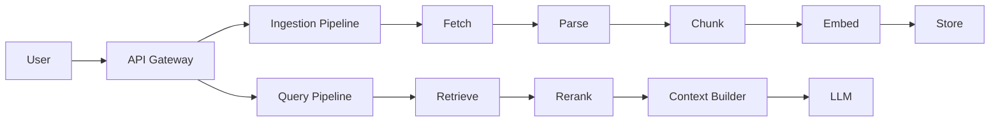
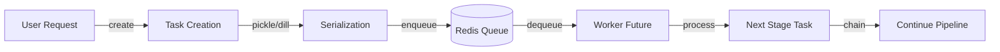
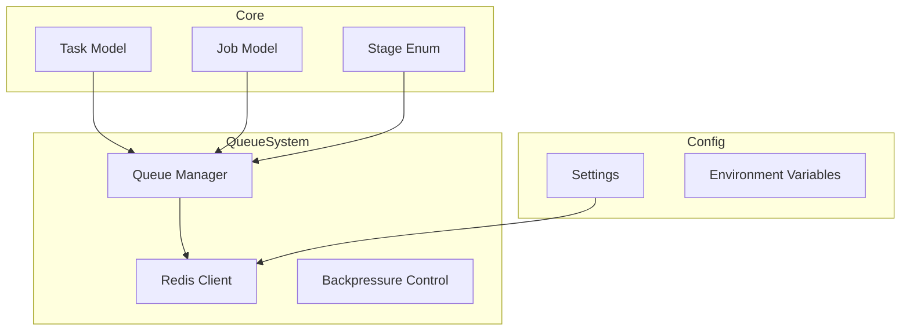
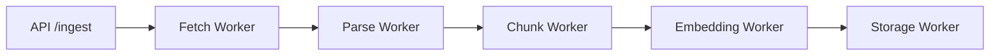
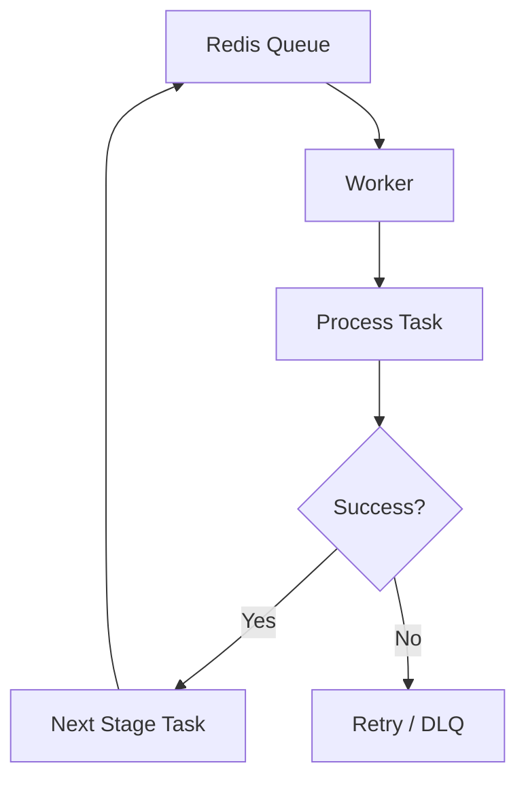

# RepoMind — Daily Report

---

# Day 1 — Architecture & Pipeline Design

## Objective

The goal of Day 1 was to design a **clear, scalable, and production-oriented pipeline architecture** before starting implementation.

The focus was on ensuring that the system is not built as a simple RAG application, but as a **distributed, asynchronous pipeline system**.

---

## Work Completed

### 1. Pipeline Design

Designed two major pipelines:

* **Ingestion Pipeline (Async, Heavy)**

  * Fetch → Parse → Chunk → Embed → Store

* **Query Pipeline (Low Latency)**

  * Query → Retrieval → Rerank → Context → LLM → Response

---

### 2. Architectural Decisions

* Adopted **queue-driven architecture** for decoupling stages
* Designed system around **task-based execution model**
* Introduced **worker-based processing**
* Defined **streaming pipeline behavior** for ingestion
* Planned **hybrid retrieval (vector + keyword + metadata)**

---

### 3. System Concepts Finalized

* Backpressure handling via bounded queues
* Cancellation propagation using global job state
* Retry strategies with exponential backoff
* Rate limiting for embedding and LLM calls
* Workspace layer for temporary repo storage

---

### 4. High-Level Architecture



---

## Outcome

* A **complete system blueprint** was defined
* All major components, workflows, and control mechanisms were finalized
* The system design is **scalable, fault-tolerant, and production-oriented**

---

# Day 2 — Core Infrastructure Implementation

---

## Objective

Implement the **foundational infrastructure layers** required to support the designed architecture, focusing on:

* Task abstraction
* Queue system
* Async execution backbone

---

## Current State Summary

RepoMind has successfully completed the **core infrastructure layer** of a distributed system.

The system is not yet executing pipelines, but all **core primitives and async backbone** are implemented and validated.

---

## Completed Phases

---

### Phase 0 — Repository & Environment Setup

#### Achievements

* Monorepo structure initialized
* Modular architecture defined
* Python environment configured
* Configuration system using environment variables
* Logging system initialized

---

### Phase 1 — Core System Primitives

#### Achievements

* Task model using Pydantic
* Job model for global control and lifecycle
* Stage enum representing pipeline stages
* Serialization and deserialization utilities
* Centralized constants for queues, retries, and limits

#### Key Insight

Tasks are the **fundamental unit of execution**, enabling distributed and asynchronous processing.

---

### Phase 2 — Redis Queue System

#### Achievements

* Async Redis client implemented (singleton pattern)
* Queue abstraction layer:

  * push_task
  * pop_task (blocking)
  * queue_size
* JSON-based task transport
* Backpressure mechanism via bounded embedding queue
* Dead Letter Queue support for failure handling

#### Key Insight

The system is now **fully decoupled and asynchronous**, with Redis acting as the communication backbone.

---

## Validation Completed

### Task Round Trip Test

```text
Task → Serialize → Redis → Deserialize → Task
```

Result: Successful

This confirms the correctness of:

* Task model
* Serialization layer
* Queue system

---

## Issues Encountered & Resolved

---

### Module Naming Conflict (`queue`)

#### Problem

The custom `queue` module conflicted with Python’s standard library module.

#### Fix

Renamed module to `queue_system`.

#### Lesson

Avoid naming modules after Python standard libraries to prevent import conflicts.

---

## Current Architecture State

---

### Data Flow (High-Level)



---

### System Layers



---

## Current Code Structure

```text
repomind/
├── api/
├── core/
├── models/
├── queue_system/
├── workers/        (structure ready)
├── services/       (structure ready)
├── pipeline/       (structure ready)
├── workspace/
├── tests/
```

---

## What Is Not Built Yet

---

### Worker Engine (Next Phase)

* Task execution loop
* Retry handling during execution
* Cancellation propagation in runtime
* Worker lifecycle management

---

### Ingestion Pipeline

* Repository fetching
* Code parsing
* Chunking logic
* Embedding generation
* Storage integration

---

### Query Pipeline

* Retrieval system
* Reranking logic
* Context builder
* LLM integration and streaming

---

## System Capability (Current)

| Capability         | Status               |
| ------------------ | -------------------- |
| Task creation      | Completed            |
| Queue system       | Completed            |
| Async backbone     | Partial (no workers) |
| Backpressure       | Implemented          |
| Pipeline execution | Not started          |

---

# Day 3 — Execution Layer & API Exposure

---

## Objective

Transition RepoMind from a **static infrastructure system** into an **active execution system** capable of:

* Running ingestion pipelines end-to-end
* Handling real repository data
* Exposing system functionality via APIs

---

## Work Completed

---

### 1. Worker Engine Implementation (Phase 3)

#### Achievements

* Implemented a generic `BaseWorker` abstraction
* Designed continuous worker loop:

  * dequeue → validate → execute → enqueue next
* Integrated retry mechanism:

  * exponential backoff strategy
  * retry limits
  * Dead Letter Queue (DLQ) handling
* Implemented cancellation propagation:

  * workers check job status before and after execution

#### Key Insight

> Workers act as **stateless executors**, while orchestration is handled through queues and tasks.

---

### 2. Workspace Management System (Phase 4)

#### Achievements

* Implemented isolated workspace per job:

  ```
  /workspace/repo_<job_id>/
  ```
* Added repository cloning using shallow git clone
* Built file utilities:

  * recursive file listing
  * safe file reading with encoding handling
* Implemented robust cleanup:

  * retry-based deletion (Windows-safe)
  * read-only file handling
  * stale workspace cleanup at startup

#### Issues Encountered

* File deletion failures due to Windows file locks (`PermissionError`)

#### Fix

* Implemented retry mechanism with delay
* Added read-only file handling using `chmod`

#### Key Insight

> File system operations are **non-deterministic in real environments** and require defensive handling.

---

### 3. Ingestion Pipeline Implementation (Phase 5)

#### Achievements

Implemented full pipeline:

```
Fetch → Parse → Chunk → Embed → Store
```

---

#### Fetch Worker

* Clones repository into workspace
* Initializes pipeline by pushing parse task

---

#### Parse Worker

* Traverses repository structure
* Extracts all file paths
* Passes file list to chunk stage

---

#### Chunk Worker (Streaming)

* Reads file content
* Generates basic chunks
* Streams tasks directly to embedding queue

---

#### Embedding Worker

* Introduced async semaphore for rate limiting
* Simulated embedding generation (placeholder)
* Pushes results to storage queue

---

#### Storage Worker

* Simulated storage layer using logging
* Placeholder for:

  * vector database
  * metadata storage
  * keyword indexing

---

#### Pipeline Characteristics

* Fully asynchronous
* Streaming execution (no batching)
* Backpressure-aware (bounded embedding queue)

#### Key Insight

> The system now behaves as a **continuous data processing pipeline**, not a batch system.

---

### 4. API Layer Implementation (Phase 6)

#### Achievements

* Built FastAPI-based control layer
* Implemented endpoints:

  **POST /ingest**

  * creates job
  * enqueues fetch task

  **GET /job/{job_id}**

  * retrieves job status

  **POST /job/{job_id}/cancel**

  * triggers cancellation

---

#### Job State Management

* Implemented Redis-based job store:

  ```
  job:{job_id}:status
  ```
* Enabled system-wide cancellation propagation

---

#### Key Insight

> The system is now split into:
>
> * **Control Plane** → API layer
> * **Execution Plane** → Workers + Queues

---

### 5. Codebase Improvements

#### Additions

* `graceful_shutdown.py`

  * prepares system for controlled worker termination
* `exceptions.py`

  * centralized exception handling structure

#### Purpose

* Improve maintainability
* Prepare for production-level robustness

---

## Current Architecture State

---

### End-to-End Ingestion Flow



---

### Execution Model



---

## System Capability (Current)

| Capability           | Status      |
| -------------------- | ----------- |
| Task system          | Completed   |
| Queue system         | Completed   |
| Worker execution     | Completed   |
| Ingestion pipeline   | Completed   |
| Streaming processing | Implemented |
| API layer            | Completed   |
| Cancellation         | Implemented |
| Storage layer        | Placeholder |
| Query pipeline       | Not started |

---

## What Is Not Built Yet

---

### Query Pipeline (Next Major Step)

* Hybrid retrieval (vector + keyword + metadata)
* Reranking logic
* Context builder
* LLM integration and streaming

---

### Storage Layer

* Vector database integration
* Metadata indexing
* Keyword search system

---

### Observability & Control

* Job completion tracking
* Failure analytics
* Metrics and monitoring

---

## Final Assessment

RepoMind has now evolved into:

> A **fully functional asynchronous ingestion system with API-level control**

The system successfully demonstrates:

* Distributed task execution
* Queue-driven architecture
* Streaming data processing
* Real-world system robustness

---

## Next Phase

### Phase 7 — Query Pipeline

Focus:

* Retrieval intelligence
* LLM integration
* User-facing query system

---

