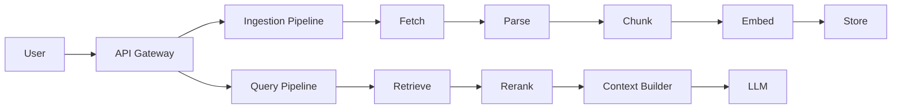
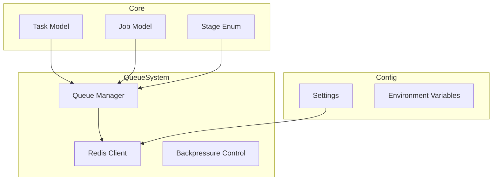

# RepoMind — Daily Report

---

# Day 1 — Architecture & Pipeline Design

## Objective

The goal of Day 1 was to design a **clear, scalable, and production-oriented pipeline architecture** before starting implementation.

The focus was on ensuring that the system is not built as a simple RAG application, but as a **distributed, asynchronous pipeline system**.

---

## Work Completed

### 1. Pipeline Design

Designed two major pipelines:

* **Ingestion Pipeline (Async, Heavy)**

  * Fetch → Parse → Chunk → Embed → Store

* **Query Pipeline (Low Latency)**

  * Query → Retrieval → Rerank → Context → LLM → Response

---

### 2. Architectural Decisions

* Adopted **queue-driven architecture** for decoupling stages
* Designed system around **task-based execution model**
* Introduced **worker-based processing**
* Defined **streaming pipeline behavior** for ingestion
* Planned **hybrid retrieval (vector + keyword + metadata)**

---

### 3. System Concepts Finalized

* Backpressure handling via bounded queues
* Cancellation propagation using global job state
* Retry strategies with exponential backoff
* Rate limiting for embedding and LLM calls
* Workspace layer for temporary repo storage

---

### 4. High-Level Architecture



---

## Outcome

* A **complete system blueprint** was defined
* All major components, workflows, and control mechanisms were finalized
* The system design is **scalable, fault-tolerant, and production-oriented**

---

# Day 2 — Core Infrastructure Implementation

---

## Objective

Implement the **foundational infrastructure layers** required to support the designed architecture, focusing on:

* Task abstraction
* Queue system
* Async execution backbone

---

## Current State Summary

RepoMind has successfully completed the **core infrastructure layer** of a distributed system.

The system is not yet executing pipelines, but all **core primitives and async backbone** are implemented and validated.

---

## Completed Phases

---

### Phase 0 — Repository & Environment Setup

#### Achievements

* Monorepo structure initialized
* Modular architecture defined
* Python environment configured
* Configuration system using environment variables
* Logging system initialized

---

### Phase 1 — Core System Primitives

#### Achievements

* Task model using Pydantic
* Job model for global control and lifecycle
* Stage enum representing pipeline stages
* Serialization and deserialization utilities
* Centralized constants for queues, retries, and limits

#### Key Insight

Tasks are the **fundamental unit of execution**, enabling distributed and asynchronous processing.

---

### Phase 2 — Redis Queue System

#### Achievements

* Async Redis client implemented (singleton pattern)
* Queue abstraction layer:

  * push_task
  * pop_task (blocking)
  * queue_size
* JSON-based task transport
* Backpressure mechanism via bounded embedding queue
* Dead Letter Queue support for failure handling

#### Key Insight

The system is now **fully decoupled and asynchronous**, with Redis acting as the communication backbone.

---

## Validation Completed

### Task Round Trip Test

```text
Task → Serialize → Redis → Deserialize → Task
```

Result: Successful

This confirms the correctness of:

* Task model
* Serialization layer
* Queue system

---

## Issues Encountered & Resolved

---

### Module Naming Conflict (`queue`)

#### Problem

The custom `queue` module conflicted with Python’s standard library module.

#### Fix

Renamed module to `queue_system`.

#### Lesson

Avoid naming modules after Python standard libraries to prevent import conflicts.

---

## Current Architecture State

---

### Data Flow (High-Level)

```mermaid
flowchart LR
    A[User Request] --> B[Task Creation]
    B --> C[Serialization]
    C --> D[Redis Queue]
    D --> E[Worker (Future)]
    E --> F[Next Stage Task]
```

---

### System Layers



---

## Current Code Structure

```text
repomind/
├── api/
├── core/
├── models/
├── queue_system/
├── workers/        (structure ready)
├── services/       (structure ready)
├── pipeline/       (structure ready)
├── workspace/
├── tests/
```

---

## What Is Not Built Yet

---

### Worker Engine (Next Phase)

* Task execution loop
* Retry handling during execution
* Cancellation propagation in runtime
* Worker lifecycle management

---

### Ingestion Pipeline

* Repository fetching
* Code parsing
* Chunking logic
* Embedding generation
* Storage integration

---

### Query Pipeline

* Retrieval system
* Reranking logic
* Context builder
* LLM integration and streaming

---

## System Capability (Current)

| Capability         | Status               |
| ------------------ | -------------------- |
| Task creation      | Completed            |
| Queue system       | Completed            |
| Async backbone     | Partial (no workers) |
| Backpressure       | Implemented          |
| Pipeline execution | Not started          |

---

## Next Phase — Worker Engine

### Goal

Enable actual execution of tasks across pipeline stages.

### Planned Work

* Base worker class
* Task processing loop
* Retry mechanism
* Cancellation handling
* Worker implementations for each stage

---

## Final Assessment

The system has successfully completed:

> The **Infrastructure Layer of a Distributed Pipeline System**

The next phase will transition the system into:

> An **Execution Engine capable of running real pipelines**

---
